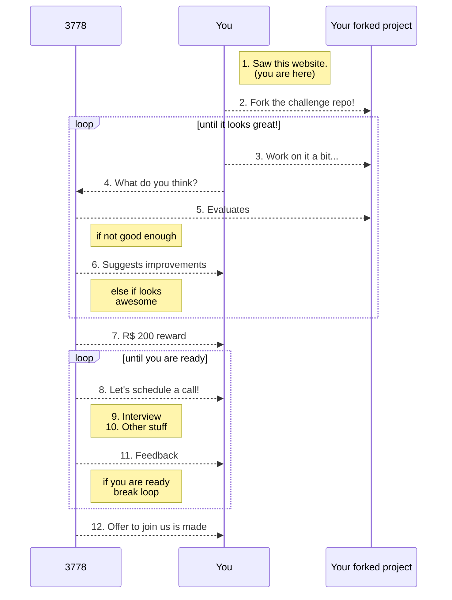

Here at 3778 we are **always** looking for talented scientists that are passionate about apply and developing machine learning algorithms for healthcare.

We believe that a selection processes should be fair and open to the widest audience possible. Therefore, we've created a new hiring process illustrated below.

<small>

</small>
