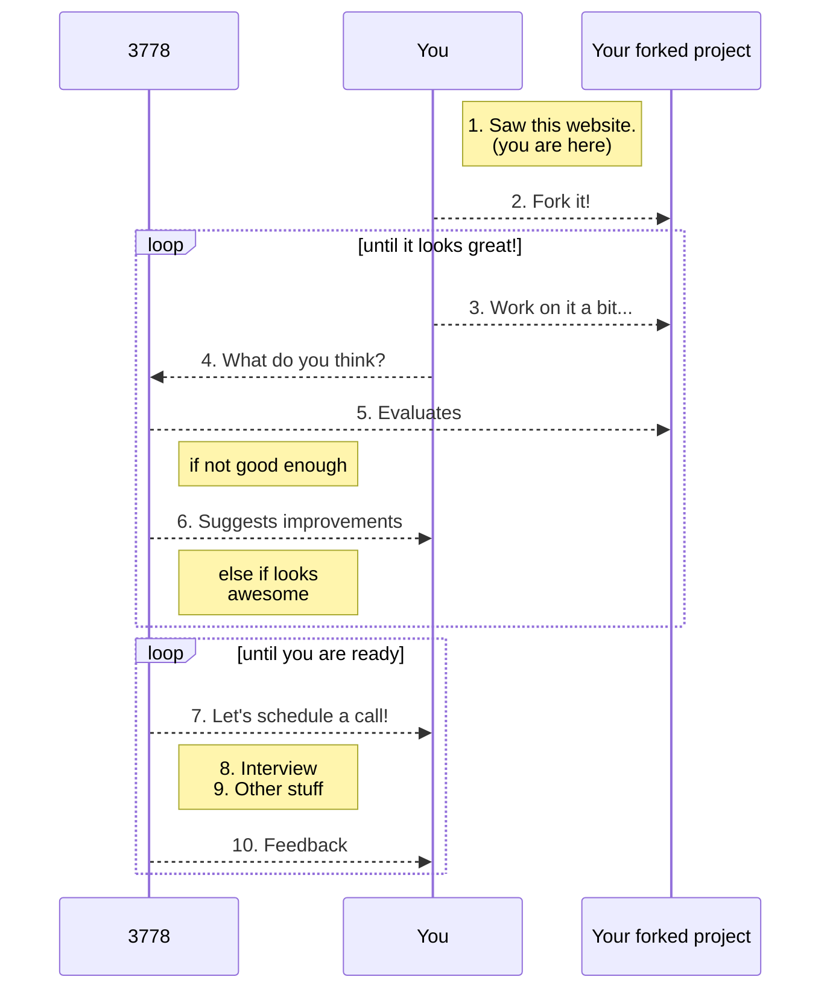

Here are 3778 we are **always** looking for talented Scientists that are passionate about apply and developing Machine Learning algorithms to healthcare.

We believe that a selection processes should be fair and open to the widest audience possible.

<small>

</small>
