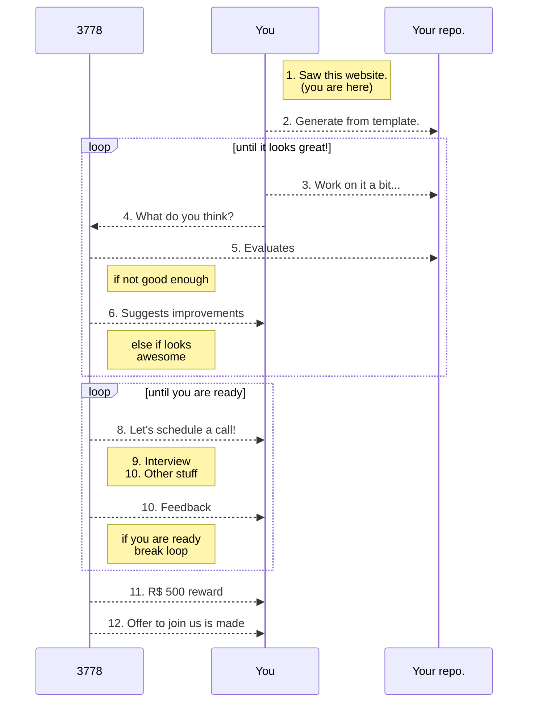

+++
math = true
+++

# <b>Data Scientist @ 3778</b>

---
Here at 3778 we are **always** looking for talented scientists, engineers and analysts that are passionate about apply and developing machine learning algorithms for healthcare. We transform data into the best health experience for people, professionals and organizations, applying our own AI algorithms, as well as UX-focused applications. Our goal is to make health services integrated and accessible for everyone.

We are an <b>Equal Opportunity Company</b> that is growing fast and we want to grow with the best team, and it takes diversity to achieve that. Regardless of your color, religion, gender, you are very welcome to our process.

## <b>Compensation and Perks</b>
We provide competitive compensation and working conditions that vary depending on contract type (CLT or PJ) and experience. Keeping teams small enables us to better understand the necessities of each person individually.

- **Salary Range:** R$ 7.000 to 15.000;
- **Remote:** Partially or fully;
- **Health insurance:** Bradesco saúde hospitalar and customized family doctor plan, even for the PJ contract option!

## <b>What skills are we looking for?</b>
---

Data Science is a spectrum, but it can be divided into 4 positions: Data Engineer, Machine Learning Specialist, Data Scientist and Business Analyst. Below, we've listed characteristics that are common amongst each. This is by no means an exhaustive list nor is it the usual "minimal requirements" for applying. Again, **this is NOT a list of requirements**.

### Data Engineer
- Interested in Scala, Python, and/or Clojure;
- Writes up mad SQL queries using WITH clauses instead of sub-queries;
- Extended knowledge of cloud providers such as AWS, GCP and Azure;
- A grounded understanding of system architectures, especially those targeted at data intensive applications;
- Working knowledge of computer networks and distributed systems;
- Security minded, and understands basic concepts of threat modeling and cryptography;
- Experience with AWS Athena/Redshift, Presto, Hive, Spark, or similar ETL and warehousing technologies;
- Knows how to exit VIM; 

### Machine Learning Specialist
- Interested in Python and Scala;
- Uses libraries such as Scikit-learn, Tensorflow, PyTorch, Keras, Dask and MLlib;
- Deploys APIs to serve machine learning models;
- Can handle unbalanced datasets; 
- Writes unit tests;
- Explains the bias-variance trade-off without blinking;
- Knows how to report on different error metrics and when to use them;

### Data Scientist
- Interested in Python, R, or Julia;
- Comfortable working with cloud providers such as AWS, GCP and Azure;
- PhD or MS degree;
- Can perform a statistical hypothesis test;
- Understands a confusion matrix;
- Explains the difference between parametric and non-parametric statistics;
- Knows what this means: $ P(X \mid Y) = \frac{P(Y \mid X)P(X)}{P(Y)}$;
- Tries to explain the Monty Hall problem and Lady tasting tea experiment at social gatherings.

### Business Analyst
- Experience or practical knowledge with healthcare;
- Mainly uses Excel, Tableau, Qlik, Power BI, but is interested in learning Python and R;
- Basic understanding of statistics, at least enough to interface with Data Scientists;
- Excellent communication, both written and verbal, and presentation abilities;
- Interested in Data visualization;
- Knows how to synthesize complex concepts to present to C-level executives;
- Doesn't shy away from talking to clients.

If you feel that you fit into one, two or maybe even all of these categories: you are welcome to apply!

## <b>Our team</b>
---
Diversity is key. Our team, spawns multiple backgrounds such as Economists, Engineers, Computer Scientists, Medical Doctors, Journalists and Designers. We are partially remote and distributed between Belo Horizonte, São Paulo and Florianópolis. More information on specific team members is available [at our homepage](https://research.3778.care/#people).

## <b>How to apply?</b>
---
We believe that a selection process should be fair and open to the widest audience possible. It should also test and teach the necessary skills. There are currently 2 ways of applying, and they differ depending on the position you are interested in. We try as much as possible to hire based on candidate **potential** and not just experience. 

### Data Engineer and Data Analyst
Currently, we don't have a challenge for these types of professionals (but we are working on it!). For now, please send your CV, LinkedIn, GitHub and anything else you might find appropriate to:

```text
join-us@3778.care
```

The subject title **must be**

```text
<position initials> - <your name>
```

otherwise, it will be deleted. For example, if Ronald Fisher was applying for the Data Engineer position the email subject would be:

```text
DE - Ronald Fisher
```

### Machine Learning Specialist and Data Scientist
We've created a public challenge that is available at our GitHub page. To apply, generate a **private** repository from [our template](https://github.com/3778/ml-challenge) and start solving the challenge. When you think it looks good enough, invite [dsevero](https://github.com/dsevero) to be a contributor on GitHub. The diagram below illustrates the rest.

<small>

</small>

## <b>This is a work in progress</b>

The concept of this process is new and you can expect some bugs along the way. Please send suggestions, complaints and appraisals to `join-us@3778.care`.
