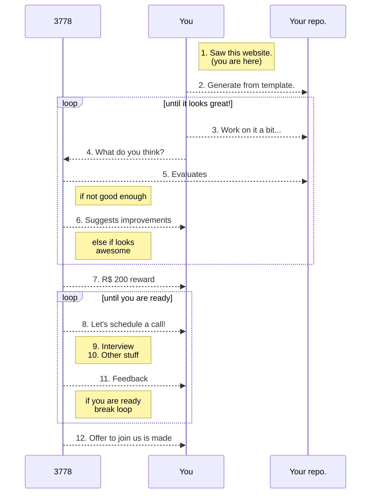

# <b>Data Scientist @ 3778</b>
---
We make data into the best health experience for people, professionals and organizations, applying our own AI algorithms, as well as other UX-focused applications. Our goal is to make health integrated and accessible for everyone.

Here at 3778 we are **always** looking for talented scientists that are passionate about apply and developing machine learning algorithms for healthcare.

We are an <b>Equal Opportunity Company</b> that is growing fast and we want to grow with the best team, and it takes diversity to achieve that. Regardless of you color, religion, gender, you are very welcome to our process.

## <b>What type of skills are we looking for?</b>
---

We are well aware that we cannot find a profile in the data field that has all the qualities altogether. Data Science is a spectrum and we usually find 3 types of professionals: Data Engineer, Data Scientist and Business Analyst. Below, we've listed caracteristics that are common amongst each. This is by no means an exhaustive list nor is it the usual "minimal requirements" for applying.

### Data Engineer
- Interested in Scala, Python, and/or Clojure;
- Comfortable working with cloud providers such as AWS, GCP and Azure;
- A grounded understanding of system architectures, especially those targeted at data intensive applications;
- Working knowledge of computer networks and distributed systems;
- Security minded, and understands basic concepts of threat modeling and cryptography;
- Knows how to exit VIM; 

### Data Scientist
- Interested in Python, R, or Julia;
- PhD or MS degree;

### Business Analyst
- Experience or practical knowledge with healthcare;
- Excellent communication, both written and verbal, and presentation abilities;
- 

## <b>Our team</b>
---
You will work with a very diverse team spawning multiple backgrounds such as Economists, Engineers, Computer Scientists, Medical Doctors, Jornalists and Designers. We are partially remote and distributed between Belo Horizonte, São Paulo and Florianópolis. More information on specific team members is available [at our homepage](https://research.3778.care/#people).

## <b>How to apply?</b>
---

We believe that a selection processes should be fair and open to the widest audience possible. To achieve this, we've created a public challenge that is available at our GitHub page. We try as much as possible to hire based on candidate **potential** and not experience. To apply, generate a **private** repository from [our template](https://github.com/3778/ml-challenge) and start solving the challenge. When you think it looks good enough, invite FULANO to be a contributor on GitHub. The diagram below illustrates the rest.

<small>

</small>
